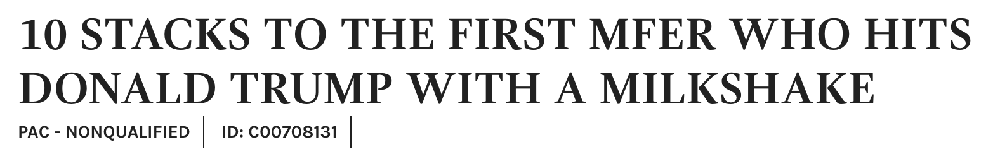
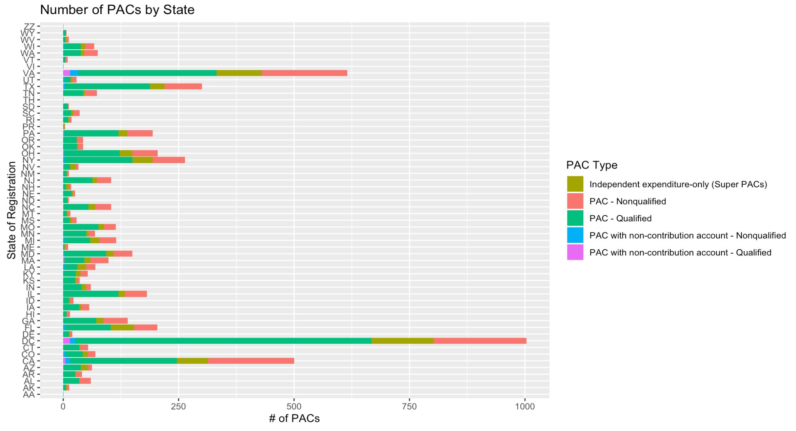

## Problem Statement and Background

- The Basics:
  - What is the FEC?
  - What is the difference between PACs and SuperPACs?
  - Where am I getting all this data from?
  
## Problem Statement and Background

- The Questions:
  - Are SuperPACs as big of a problem as everyone says that they are?
  - Can you predict what kind of PAC you get based off of variables such as:
    - State?
    - Total Contributions?
    - Total Expenditures?
  - Can I use topic modeling to group PAC names? Will I end up with "concrete" topics?
  
## Problem Statement and Background

- The dataset and its variables

{width=400px}

## Just for fun...

{width=300px}
{width=300px}

{width=300px}

{width=300px}

{width=300px}

## Methods I Explored/Considered (Fails!)

1. Classification
  - What I thought about doing: using variables to help the data learn how to classify PACs and their affiliated party
  - Problem: Not all PACs register with a party
2. Sentiment Analysis
  - What I thought about doing: Grouping PACs by their party and then running sentiment analysis to see which party was the most "positive" or "negative"
  - Problem: Not all PACs register with a party 

## Methods/Tools I Used (Thus Far)

1. Merged Excel files together and cleaned data
2. Analyzed PACs through the state that they're registered in

{width=400px}

## Methods/Tools I Used (Thus Far)

3. Analyzed PACs through their "PAC qualification status" over time

{width=400px}

## Results

- SuperPACs have boomed in popularity since Citizens United case
- The regular suspects (i.e. DC, VA, NY, CA) have the most number of PACs registered within them
- A healthy portion of registered PACs are "regular" PACS, not SuperPACs

## Lessons Learned

- Campaign finance is confusing!
- Data wrangling is 99.99% of this project so far and human error sucks
- RColorBrewer package is amazing
