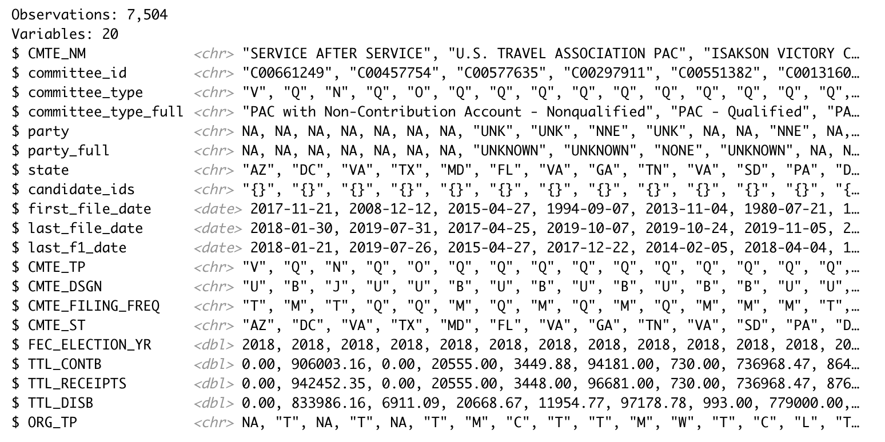
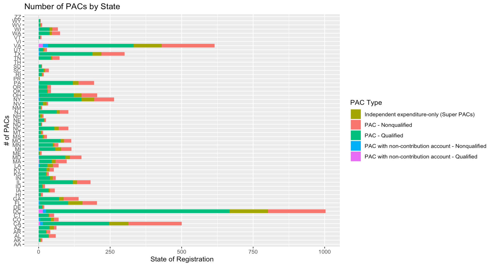
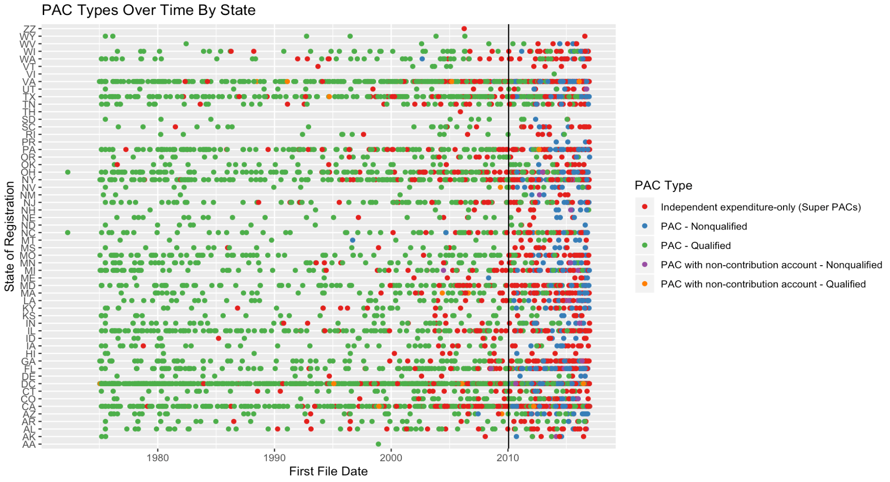

## Problem Statement and Background

- The Basics:
  - What is the FEC?
  - What is the difference between PACs and SuperPACs?
  
## Problem Statement and Background

- The Questions:
  - Can you predict what kind of PAC/SuperPAC you get based off of variables such as:
    - State?
    - Total Contributions?
    - Total Expenditures?
  - Is there a theme with PAC names?
  
## Problem Statement and Background

- The dataset and its variables

{width=750px}

## Methods I Explored/Considered

1. Classification to find registered party
  - What I thought about doing: using 
  - Problem: Not all PACs register with a party
2. Sentiment Analysis
  - What I thought about doing: 
  - Problem: Not all PACs register with a party 

## Methods/Tools I Used (Thus Far)

1. Merged Excel files together and cleaned data
2. Analyzed PACs through the state that they're registered in

{width=750px}

## Methods/Tools I Used (Thus Far)

3. Analyzed PACs through their "PAC qualification status" over time

{width=750px}

## Results

- SuperPACs have boomed in popularity since Citizens United case
- The regular suspects (i.e. DC, VA, NY, CA) have the most number of PACs registered within them with a healthy portion of them being "regular" PACS, not SuperPACs
- 

## Lessons Learned

- Campaign finance is confusing!
- Data wrangling is 99.99% of this project so far
- SuperPACs have boomed in popularity since Citizens United case
